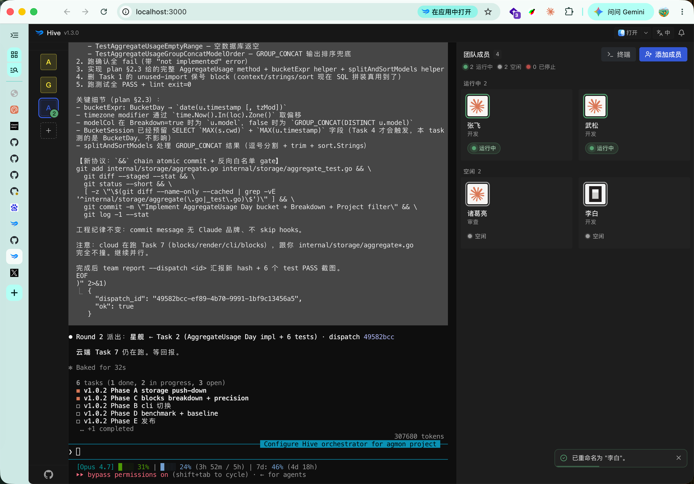

<p align="center">
  
</p>

# Hive

<p align="center">
  
</p>

**Hive 是浏览器里的 Agent 协作工作台——一群 Agent 在你本机各自开工，一个当 Orchestrator 派活、归总进展，其余各司其职。** Orchestrator 本身就是一个真实的 `claude` / `codex` / `opencode` / `gemini` 进程——不是你、也不是脚本——它派单的 Worker 同样是真 CLI agent。所有 agent 都是本机真实的 PTY 进程，通过 Hive 注入到 shell 里的小型 `team` 协议互相通信，共享 `<workspace>/.hive/tasks.md` 这份 markdown 任务图。

写代码、做调研、起草文档、做翻译——凡是能拆给一群人协作的脑力活，都可以让一群 Agent 合伙干。

[](https://www.npmjs.com/package/@tt-a1i/hive)
[](https://github.com/tt-a1i/hive/actions/workflows/release.yml)
[](https://hivehq.dev)
[](https://nodejs.org/)
[](./LICENSE.BSL)
[-lightgrey.svg)](#平台支持)

🌐 **官网**：[hivehq.dev](https://hivehq.dev/)（[English](https://hivehq.dev/en/)）

[English](./README.en.md) · 简体中文

> Hive 是本机优先的工具，只监听 `127.0.0.1`，面向已经在用 CLI Agent 的人。最新稳定版本见 [npm](https://www.npmjs.com/package/@tt-a1i/hive)，上面的 badge 会指向它。

<p align="center">
  
</p>

## 为什么需要 Hive

CLI Agent 各自都很强，但同时管几个就有点别扭：

- 长任务的会话散在好几个终端里，注意力来回切。
- 想把活儿分给几个 Agent（写代码 / review / 测试，或者调研 / 起草 / 事实核查之类），却缺一层来居中调度。
- Worker 的进度淹在 scrollback 里，回头看找不到。
- 想重启接着干，全看每个 CLI 自己的 session 恢复行为，散乱不可控。

Hive 加上这一层调度，**不替换**任何 CLI。Agent 还是真实跑在你电脑上的终端进程，Hive 只是它们外面的"团队 shell"。

## 先看看 demo

还没装任何 agent CLI？运行 `hive`、打开它打印出的本地地址、在 first-run 向导里点 **Try Demo**。你会看到一个完全跑在客户端的预览——假 orchestrator + 两个 worker、预录的终端 scrollback、一份预填的任务清单——既不会连服务器，也不需要任何真实 CLI agent。适合决定要不要继续装真 CLI。

## 快速开始

前置条件：

- Node.js 22 或更新版本
- 至少一个支持的 Agent CLI 已经安装好、登录过、在 `PATH` 上可调用

安装并启动 Hive：

```bash
npm install -g @tt-a1i/hive
hive
```

打开终端打印出来的本机地址，通常是 `http://127.0.0.1:3000/`。如果你想指定端口，可以用 `hive --port 4010`。

升级到最新版本：

```bash
hive update
```

`hive update` 会在原位运行 `npm install -g @tt-a1i/hive@latest`，完事后重启 Hive 就能用上新版。如果当初是用 pnpm / yarn 装的 Hive，请用同一个包管理器升级，避免装出第二份。

把 Hive 装为应用（可选）：

在 Chrome / Edge / Brave 里打开 `http://127.0.0.1:3000/`，点浏览器地址栏右侧的安装图标即可。装好后 Hive 会以独立窗口启动、有自己的 dock 图标，且 dock 右键菜单上会显示 **添加 Workspace** / **试用演示** 两个快捷入口。Firefox 和 Safari 暂未实现 PWA install-prompt 协议，浏览器地址栏的安装图标只在 Chromium 系浏览器里出现。

PWA 只是 UI 壳，Hive 后端仍需要在终端里跑着。如果启动 PWA 时后端没起，会看到 “Hive 后端未启动” 页面，等你跑起 `hive` 后会自动刷新。PWA 的 install scope 按 origin（含端口）划分，所以 `hive --port 4011` 跟 `hive --port 3000` 在浏览器看来是两个独立应用。卸载方法：浏览器地址栏访问 `chrome://apps`，右键 Hive 图标，选 **从 Chrome 中移除…**。

关闭 PWA 窗口或 tab 时 Hive 会主动请求浏览器弹原生确认对话框，避免 Cmd+W 误关丢失会话。但现代浏览器要求你跟页面"交互过"（点击 / 滚动 / 输入）才会真的弹这个对话框——刚打开 PWA 立刻按 Cmd+W 仍会直接关闭，这是浏览器策略，不是 Hive 的 bug。

首次使用流程：

1. 选择一个项目目录作为 workspace。
2. 挑一个 Orchestrator 预设。
3. Hive 会创建 `<workspace>/.hive/tasks.md`，启动 Orchestrator 的 PTY，把内部的 `team` 命令注入这个 agent 会话。
4. 在 Team Members 面板里添加 Worker。
5. 跟 Orchestrator 说一声让它派活，它会用 `team send <worker-name> "<task>"` 发任务，Worker 完事后用 `team report` 回报。

## 工作方式

```text
浏览器 UI 跑在 127.0.0.1
  任务 · 团队 · 终端 · 汇报
          |
          | HTTP + WebSocket
          v
Hive Runtime
  SQLite 元数据 · PTY 生命周期 · 任务派单
          |
          +-- Orchestrator PTY
          |     可调用：team send、team list、team report
          |
          +-- Worker PTY
          |     可调用：team report
          |
          +-- Worker PTY
                可调用：team report

Workspace 任务图：
  <workspace>/.hive/tasks.md
```

三个细节值得记住：

- Agent 是真正的 CLI 进程，不是模拟的 subagent。
- `team` 命令**只**在 Hive 管理的 agent 会话里可用——通过把包内 bin 目录 prepend 到 PATH 实现，不会装成全局命令。
- 任务图就是 workspace 里的一份 markdown 文件，你可以在编辑器里直接看或者改。

## Agent 预设

| 预设 | `PATH` 上的命令 | 默认 bypass 模式 | 会话恢复 |
| --- | --- | --- | --- |
| Claude Code | `claude` | `--dangerously-skip-permissions`、`--permission-mode=bypassPermissions` | `--resume <session_id>` |
| Codex | `codex` | `--dangerously-bypass-approvals-and-sandbox` | `resume <session_id>` |
| OpenCode | `opencode` | 由 `~/.config/opencode/opencode.json` 配置 | `--session <session_id>` |
| Gemini | `gemini` | `--yolo` | `--resume <session_id>` |
| 自定义 | 任意可执行文件 | 自己配 | 自己配 |

Hive 不替你安装这些 CLI。请在启动 Hive 的同一个 shell 环境里先装好、登录好。

## Hive 提供什么

- Workspace 侧边栏，方便在多个本机项目之间切换。
- Orchestrator 和 Worker 终端都是真实 PTY 支撑的。
- Add Worker 预置 coder / reviewer / tester 等角色模板，也支持完全自定义 prompt 与命令——把任何 CLI agent 编排成你需要的角色。
- `.hive/tasks.md` 编辑器，带外部文件冲突处理。
- PTY 后台保留 + 尽力使用各 CLI 原生 session 恢复。
- 元数据存在本机 SQLite，默认在 `~/.config/hive`，或者通过 `$HIVE_DATA_DIR` 指定。

Hive **不**提供 sandbox 隔离、多用户认证、云端托管，也不自带任何 agent 模型。它只负责调度你已经在用的本机 CLI。

## 平台支持

所有平台都需要 Node.js 22+。Hive 依赖 `node-pty` 和 `better-sqlite3` 这类原生包，没有预编译二进制时需要你本机有原生构建工具链。

## 安全模型

Hive 是本机开发工具，**不是**托管服务。

- Runtime 只监听 `127.0.0.1`。不要把 Hive 端口通过公网隧道、反向代理或任何共享网络接口暴露出去。
- 内置预设会主动传 CLI 的 non-interactive / bypass flag。Worker 在选中的 workspace 里有跟启动 shell **同等**的执行权限——把它当成"会自动跑命令的你自己"。
- 只打开你信任的 workspace。Worker 拥有跟你登录账户一样的文件系统访问权限。
- Agent token 是 session 级的，由本机 runtime 生成，注入到 agent 进程环境变量里，**不**用于跨网络通信。
- Hive 不做多用户认证。任何能从本机访问到端口的进程都视为可信本地访问。
- 浏览器 UI token 只是本机会话保护，不是用来防同一系统账户下其他进程的安全边界。

在敏感仓库里用 Hive 之前，请先读 [SECURITY.md](SECURITY.md)。

## 数据位置

| 数据 | 位置 |
| --- | --- |
| Runtime 元数据 | `~/.config/hive` 或 `$HIVE_DATA_DIR` |
| Workspace 任务图 | `<workspace>/.hive/tasks.md` |
| 内部 `team` 命令 | 包内 `dist/bin/`，通过 PATH 注入 PTY |
| Web UI 资源 | 由 runtime 从包内 `web/dist` 直接服务 |

## 故障排查

**找不到 Agent CLI**

确认选中的命令已经安装好、登录好、在启动 Hive 那个 shell 里能直接调用，且在 `PATH` 上。

**端口被占用**

换个本机端口启动：

```bash
hive --port 4020
```

**原生包构建失败**

Hive 依赖 `node-pty` 和 `better-sqlite3`，它们用原生二进制。确认 Node.js 22+，清干净 package manager 缓存，并准备好你平台的构建工具（macOS Xcode CLI、Linux build-essential + python3、Windows VS Build Tools）。

安装时如果看到 `prebuild-install@7.1.3` 的 deprecated warning，可以忽略。它来自 `better-sqlite3` 的原生二进制下载链路，只是上游安装器维护状态提示，不代表 Hive 安装失败，也不会影响运行。

**Linux 上目录选择器不弹**

装 `zenity`，或者直接在对话框里粘路径。

**Windows 上目录选择器不弹**

确认 `powershell.exe` 在 `PATH` 上，或者直接粘路径。

**Tasks 文件冲突 banner 出现**

Hive 检测到磁盘上的 `.hive/tasks.md` 比 UI 里的新。`Reload` 接受磁盘版本，`Keep Local` 保留 UI 编辑并覆盖保存。

**Worker 卡在 `working` 状态**

Hive 不通过进程活动猜测任务完成。Worker 只有在调 `team report` 时才会回到 `idle`。如果它确实卡了，从 UI 里 Stop 或 Restart。

## 开发

```bash
pnpm install
pnpm dev
```

开发模式下 runtime 跑在 `127.0.0.1:4010`，Vite 跑在 `127.0.0.1:5180`，把 API 和 WebSocket 代理到 runtime。

常用命令：

```bash
pnpm check
pnpm build
pnpm test
```

预演 production 构建：

```bash
pnpm build
node dist/src/cli/hive.js --port 4010
```

Production 模式下 runtime 直接服务构建好的 web UI，不需要单独的 Vite。

## 发布

维护者本地预演：

```bash
pnpm release:dry
```

完整 tag 发版清单见 [docs/release.md](docs/release.md)，里面包含 Windows 手动 smoke 步骤。

带 `v*` 的 tag push 会触发 GitHub Actions release workflow。workflow 会在 macOS、Ubuntu、Windows 三平台验证，然后用 `NPM_TOKEN` 发布到 npm。

## 状态

Hive 目前处于 alpha 阶段，核心流程已可用。当前重点是继续打磨多 Agent 协作体验、Windows 支持和更清晰的调度可观测性。欢迎试用、提 issue——反馈会直接影响后续节奏。

## 另一种形态：squad

如果你更喜欢 **纯 CLI、零后台进程、能直接在 SSH 进的远端服务器上跑** 的形态，[squad](https://github.com/mco-org/squad) 是同一个想法的另一条路线——SQLite 当通信层，每个 agent 各自开一个终端。两个项目互不替代，按工作流挑就行：

- **Hive** — 想要可视化工作台、一键重启、侧边栏切 workspace、给团队演示
- **squad** — 活在 tmux 里、SSH 远端开发、不想跑额外后台进程、Windows server

## License

Hive 在 Business Source License 1.1 下开源。个人使用、内部部署、嵌入、fork 都可以；详细边界见 [LICENSE.BSL](LICENSE.BSL)。
